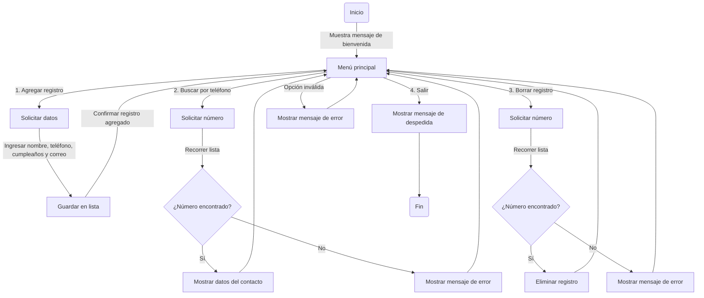
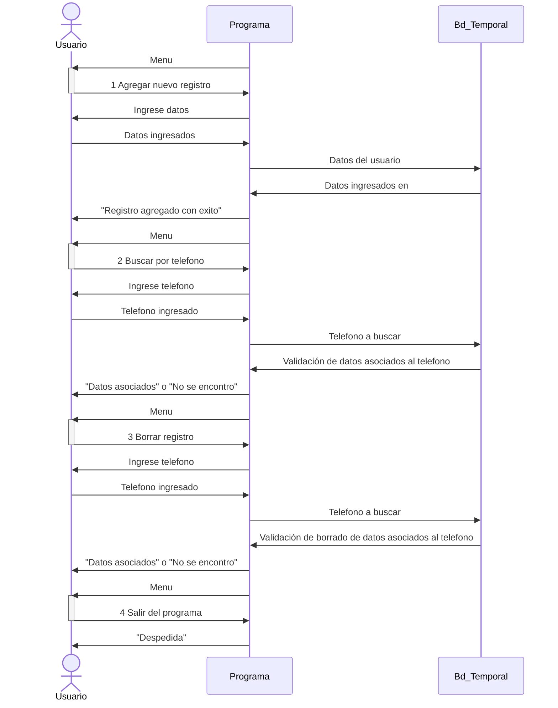

```mermaid
graph TD;
    A(Inicio) -->|Muestra mensaje de bienvenida| B[Menú principal];
    B -->|1. Agregar registro| C[Solicitar datos];
    C -->|Ingresar nombre, teléfono, cumpleaños y correo| D[Guardar en lista];
    D -->|Confirmar registro agregado| B;
    
    B -->|2. Buscar por teléfono| E[Solicitar número];
    E -->|Recorrer lista| F{¿Número encontrado?};
    F -->|Sí| G[Mostrar datos del contacto];
    F -->|No| H[Mostrar mensaje de error];
    G --> B;
    H --> B;
    
    B -->|3. Borrar registro| I[Solicitar número];
    I -->|Recorrer lista| J{¿Número encontrado?};
    J -->|Sí| K[Eliminar registro];
    J -->|No| L[Mostrar mensaje de error];
    K --> B;
    L --> B;
    
    B -->|4. Salir| M[Mostrar mensaje de despedida];
    M --> N(Fin);
    
    B -->|Opción inválida| O[Mostrar mensaje de error];
    O --> B;

```

# Diagrama de Secuencia

```mermaid
sequenceDiagram
    actor Usuario
    participant Programa
    participant Bd_Temporal
    Programa->> Usuario: Menu
    activate Usuario
    Usuario->>Programa: 1 Agregar nuevo registro
    deactivate Usuario
    Programa->>Usuario: Ingrese datos
    Usuario->>Programa: Datos ingresados
    Programa->> Bd_Temporal: Datos del usuario
    Bd_Temporal->>Programa: Datos ingresados en 
    Programa->> Usuario: "Registro agregado con exito"

    Programa->> Usuario: Menu
    activate Usuario
    Usuario->>Programa: 2 Buscar por telefono
    deactivate Usuario
    Programa->>Usuario: Ingrese telefono
    Usuario->>Programa: Telefono ingresado
    Programa->> Bd_Temporal: Telefono a buscar
    Bd_Temporal->>Programa: Validación de datos asociados al telefono 
    Programa->> Usuario: "Datos asociados" o "No se encontro"

    Programa->> Usuario: Menu
    activate Usuario
    Usuario->>Programa: 3 Borrar registro
    deactivate Usuario
    Programa->>Usuario: Ingrese telefono
    Usuario->>Programa: Telefono ingresado
    Programa->> Bd_Temporal: Telefono a buscar
    Bd_Temporal->>Programa: Validación de borrado de datos asociados al telefono 
    Programa->> Usuario: "Datos asociados" o "No se encontro"

    Programa->> Usuario: Menu
    activate Usuario
    Usuario->>Programa: 4 Salir del programa
    deactivate Usuario
    Programa->>Usuario: "Despedida"
```
